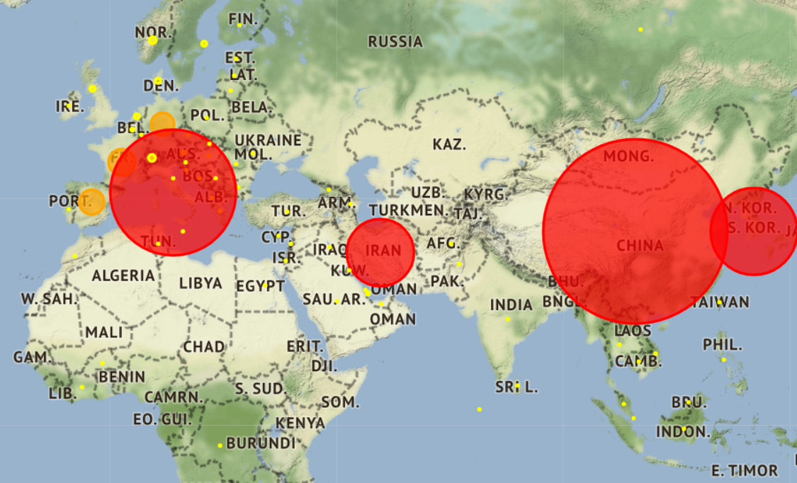
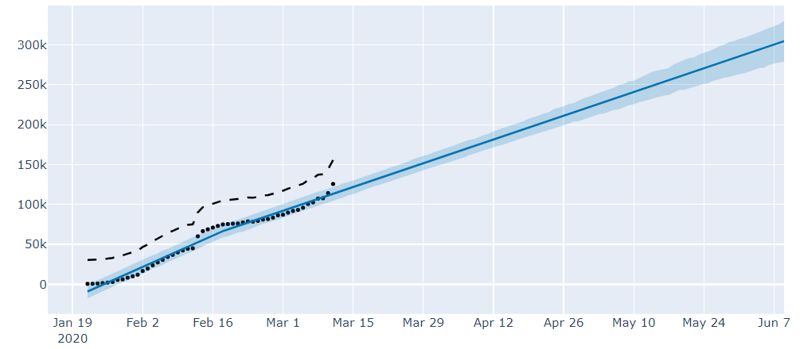

# CoronavirusNL

The code contains many visualizations for the coronavirus data, from maps to graphs. It also contains predictions for future cases using the Prophet algorithm.

An example of the map is the below where red, orange, and yellow are for more than 5K, 1K, and 0 cases respectively. The radius of the circle depends on the cases' number.

Using Prophet algorithm, forecasting fot the confimed cases number was done for the upcoming 3 months. As prediction, by June we are reaching more than 300K coronavirus cases!

The data is updated daily from https://github.com/CSSEGISandData/COVID-19

The countries.csv file contains the location for each country.

Prophet: Taylor SJ, Letham B. 2017. Forecasting at scale. PeerJ Preprints 5:e3190v2 https://doi.org/10.7287/peerj.preprints.3190v2
